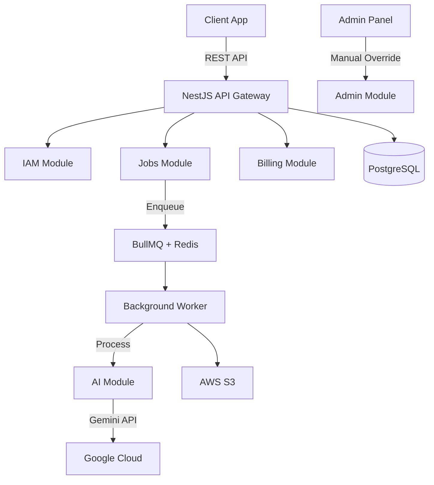

# Photo Expert API

> AI-powered professional photography generation platform for e-commerce and content creators.

## 🎯 The Problem

E-commerce businesses and content creators struggle to produce high-quality product photography consistently and affordably. Professional photo shoots are expensive, time-consuming, and often require multiple iterations.

## 💡 The Solution

**Photo Expert** democratizes professional photography through AI. Upload your product image, select a style (e.g., "E-commerce Pro"), and receive studio-quality results in minutes—without cameras, lighting equipment, or professional photographers.

## ✨ Key Features

- **🎨 Multiple AI Modes**: E-commerce Pro, Portrait, Lifestyle (Powered by Gemini 2.0)
- **💳 Multi-Provider Payments**: Support for Mercado Pago, Culqi, and Crypto (Strategy Pattern)
- **🔒 Secure & Scalable**: Enterprise-grade authentication and async processing
- **👁️ Deep Observability**: High-performance logging (Pino) and Error Tracking (Sentry)
- **📊 Admin Dashboard**: Real-time job management and quality control

## 🏗️ Architecture



**Design Pattern**: Hexagonal Architecture (Ports & Adapters) + Domain-Driven Design

## 🚀 Tech Stack

| Layer          | Technology                          |
| :------------- | :---------------------------------- |
| **Framework**  | NestJS 10.x                         |
| **Language**   | TypeScript 5.x                      |
| **Database**   | PostgreSQL 16 + Prisma ORM          |
| **Queue**      | BullMQ + Redis                      |
| **Storage**    | AWS S3 (presigned URLs)             |
| **AI**         | Google Gemini 2.0 (Vertex AI)       |
| **Auth**       | JWT + Passport                      |
| **Payments**   | Mercado Pago, Culqi                 |
| **Logs**       | Pino (JSON) + Sentry                |
| **Validation** | class-validator + class-transformer |

## 📦 Project Structure

```
src/
├── modules/
│   ├── iam/          # Identity & Access Management
│   ├── jobs/         # Job orchestration & processing
│   ├── billing/      # Credits & subscriptions
│   ├── uploads/      # File storage & presigned URLs
│   └── admin/        # Admin-only endpoints
├── shared/
│   ├── ai/           # AI adapters (Gemini)
│   ├── config/       # Environment configuration
│   └── persistence/  # Database connection
├── main.ts           # API entry point
└── worker.ts         # Background worker entry point
```

See individual module READMEs for detailed documentation:

- [IAM Module](./src/modules/iam/README.md)
- [Jobs Module](./src/modules/jobs/README.md)
- [Billing Module](./src/modules/billing/README.md)
- [Payments Module](./src/modules/payments/README.md)
- [Admin Module](./src/modules/admin/README.md)
- [Uploads Module](./src/modules/uploads/README.md)

## 🏃 Quick Start

### Prerequisites

- Node.js 20+
- PostgreSQL 16+
- Redis 7+
- AWS S3 bucket (or compatible)
- Google Cloud account (Vertex AI enabled)

### Installation

```bash
# Clone the repository
git clone <repository-url>
cd apiaurapic

# Install dependencies
pnpm install

# Setup environment
cp .env.example .env
# Edit .env with your credentials

# Run database migrations
pnpm prisma migrate dev

# Start development server
pnpm run start:dev

# Start worker (in separate terminal)
pnpm run start:worker
```

### API Endpoints

```
POST   /auth/register          # User registration
POST   /auth/login             # User login
POST   /jobs                   # Create image processing job
GET    /jobs/:id               # Get job status
GET    /jobs                   # List user jobs
POST   /uploads/presigned-url  # Get S3 upload URL
POST   /admin/jobs/:id/complete # [Admin] Manual completion
```

Full API documentation: [Coming Soon - Swagger/OpenAPI]

## 🔧 Development

```bash
# Run tests
pnpm test

# Run e2e tests
pnpm test:e2e

# Lint
pnpm lint

# Build for production
pnpm build

# Start production
pnpm start:prod
```

## 🌍 Environment Variables

| Variable               | Description               | Example            |
| :--------------------- | :------------------------ | :----------------- |
| `DATABASE_URL`         | PostgreSQL connection     | `postgresql://...` |
| `REDIS_HOST`           | Redis hostname            | `localhost`        |
| `REDIS_PORT`           | Redis port                | `6379`             |
| `AWS_REGION`           | S3 region                 | `us-east-1`        |
| `AWS_S3_BUCKET`        | S3 bucket name            | `my-bucket`        |
| `GOOGLE_CLOUD_PROJECT` | GCP project ID            | `my-project`       |
| `MP_ACCESS_TOKEN`      | Mercado Pago Access Token | `TEST-...`         |
| `GEMINI_API_KEY`       | Google AI Studio Key      | `AIza...`          |
| `SENTRY_DSN`           | Sentry Data Source Name   | `https://...`      |
| `JWT_SECRET`           | JWT signing key           | `supersecret`      |

## 📝 License

[MIT License](./LICENSE)

## 🤝 Contributing

This is a portfolio/learning project. Contributions are welcome for educational purposes.

1. Fork the repository
2. Create your feature branch (`git checkout -b feature/AmazingFeature`)
3. Commit your changes (`git commit -m 'Add some AmazingFeature'`)
4. Push to the branch (`git push origin feature/AmazingFeature`)
5. Open a Pull Request

## 📧 Support

For questions or support, please open an issue in the repository.

---

**Built with ❤️ using NestJS**
