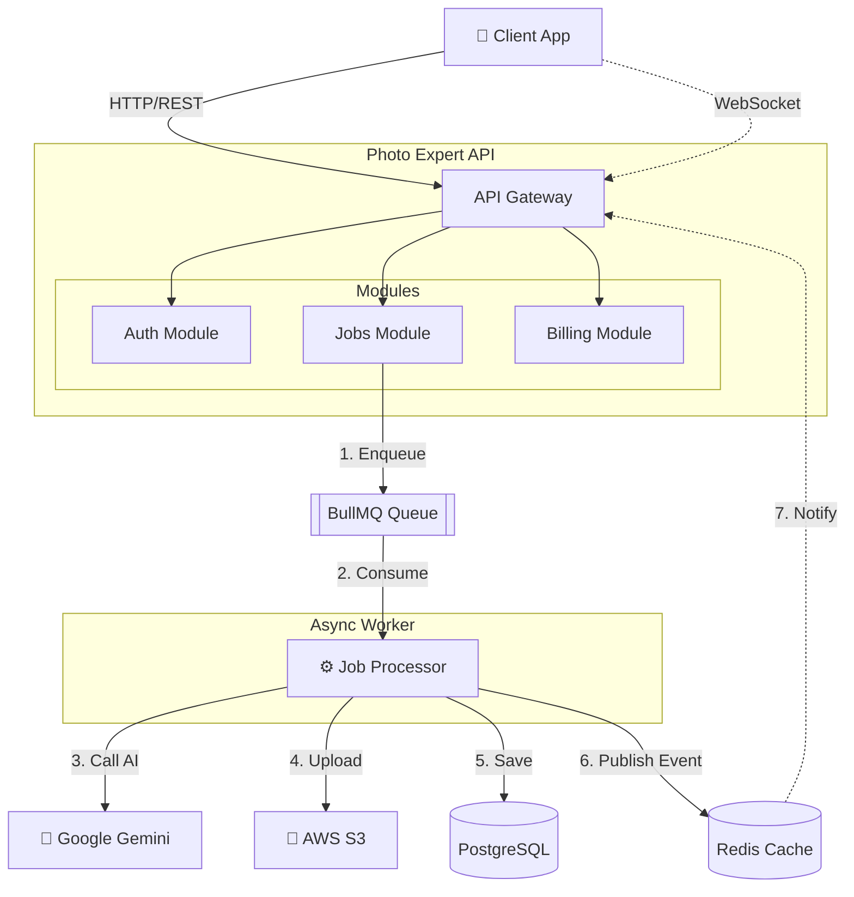

# Photo Expert API

> **AI-powered professional photography generation platform for e-commerce and content creators.**  
> _Enterprise-grade NestJS Microservice Architecture._

[](https://nodejs.org/)
[](https://www.postgresql.org/)
[](LICENSE)

---

## 🏗️ High-Level Architecture

We use a **Hexagonal Architecture (Ports & Adapters)** to decouple domain logic from infrastructure. This ensures that switching a payment provider or an AI model doesn't break business rules.



### Why this architecture?

- **Async Processing:** Image generation is slow (10s+). We use **BullMQ** to offload processing to background workers, keeping the API responsive (ADR 002).
- **Vector Search:** We use **pgvector** to enable "Context-Aware" features by storing semantic embeddings of jobs, allowing users to find "similar styles" (ADR 001).
- **Real-Time Feedback:** Uses **WebSockets (Socket.io)** over Redis Pub/Sub to instantly notify users when their generation is done, replacing inefficient polling.

---

## 🚀 Quick Start

Get the system running in less than 5 minutes.

### Prerequisites

- Node.js 20+
- Docker & Docker Compose

### 1. Setup Environment

```bash
cp .env.example .env
# ⚠️ Update .env with your real credentials (AWS, Google Cloud, Postgres)
```

### 2. Start Infrastructure (DB, Redis)

```bash
docker-compose up -d db redis
pnpm prisma migrate dev
```

### 3. Run Development Server

```bash
# Terminal 1: API
pnpm start:dev

# Terminal 2: Worker (handles AI Jobs)
pnpm start:worker
```

---

## 📚 Documentation

### Architecture Decision Records (ADR)

We document critical technical decisions to provide context for future maintainers.

- [📂 View all ADRs](./docs/adr/README.md)
- [ADR 001: Vector Memory with pgvector](./docs/adr/001-vector-memory-postgresql.md)
- [ADR 002: WebSocket Notifications](./docs/adr/002-realtime-notifications-websocket.md)

### Key Modules

- **IAM**: JWT Authentication, Hashing with Argon2.
- **Jobs**: AI Orchestration, State Machine (Pending -> Processing -> Completed).
- **Billing**: Event-driven credits system. Listens to `PaymentApprovedEvent`.
- **Payments**: Strategy pattern for multiple providers (Mercado Pago, Culqi).

---

## 🔌 API Contracts & Examples

### Job Creation (POST `/jobs`)

**Request Payload:**

```json
{
  "prompt": "Professional headshot of a woman in a business suit, studio lighting",
  "styleId": "ecommerce-pro-v1"
}
```

**Success Response (201 Created):**

```json
{
  "id": "job-123-uuid",
  "status": "PENDING",
  "createdAt": "2026-01-15T12:00:00Z"
  // Client should connect to WebSocket /jobs to listen for completion
}
```

**Error Case: Insufficient Credits (402 Payment Required):**

```json
{
  "statusCode": 402,
  "message": "Insufficient credits. Required: 1, Available: 0",
  "error": "Payment Required"
}
```

---

## 🛠️ Production Readiness

This project implements several "Hardening" patterns for production:

1.  **Health Checks**: `/health` (Liveness) and `/health/ready` (Readiness) for Kubernetes.
2.  **Graceful Shutdown**: Handles `SIGTERM` to finish in-flight requests and close DB connections cleanly.
3.  **Request ID**: Every log entry includes a unique `reqId` for end-to-end tracing.
4.  **Circuit Breaker**: (Planned) protects external AI service calls.

---

## 🤝 Contributing

1.  Fork the repo
2.  Create feature branch (`git checkout -b feature/amazing-feature`)
3.  Commit changes (`git commit -m 'feat: add amazing feature'`)
4.  Push (`git push origin feature/amazing-feature`)
5.  Open PR

---

**Built with ❤️ by [Your Name/Team]**
