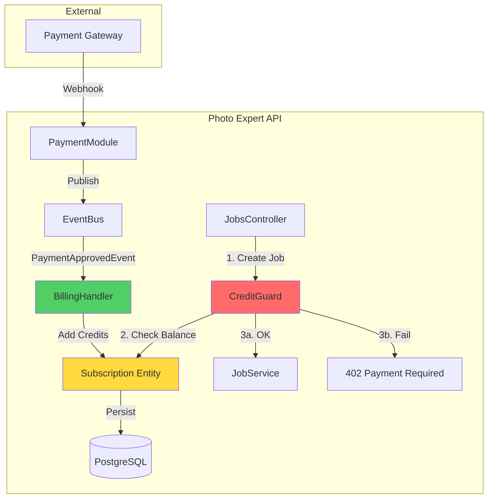

# Billing Module

**Purpose**: Manages the "Economic Physics" of the application — ensuring resources are consumed only when available.

## 🧠 Context & Decisions

### Why separate Billing from Payments?

We decoupled **Billing** (Credits, Subscriptions) from **Payments** (Mercado Pago, Culqi, Stripe) to allow flexibility.

- **Payments Module**: Handles technical integration with gateways (webhooks, signatures).
- **Billing Module**: Handles business logic (adding credits, deducting for usage).

This separation means we can switch payment providers without rewriting how credits are stored or consumed.

### Why Event-Driven?

Instead of the Payments module calling `billingService.addCredits()` directly, it publishes a `PaymentApprovedEvent`.

- **Decoupling**: Payments module doesn't need to know Billing exists.
- **Extensibility**: If we want to send a "Thank you" email later, the Notification module can just listen to the same event.
- **Resilience**: If the Billing service is down (hypothetically), events can be replayed.

## 🏗️ Architecture



## 📦 Core Components

### 1. Subscription Entity (`src/modules/billing/domain/entities/subscription.entity.ts`)

The "Heart" of the module. It encapsulates all rules about credits.

- **Invariant**: Credits cannot be negative.
- **Behavior**: `deductCredits()`, `addCredits()`.

### 2. Event Handlers

- **`PaymentApprovedHandler`**: Listens for successful payments and translates money into credits (e.g., $10 = 50 credits).

### 3. Guards

- **`CreditGuard`**: A NestJS Guard that intercepts requests to costly endpoints (like `/jobs`) and checks strict credit availability before the controller is even reached.

## 💳 Data Flow

### Credit Consumption (Standard Path)

1.  **Request**: User POSTs to `/jobs`.
2.  **Guard**: `CreditGuard` checks DB for active subscription.
3.  **Validation**: `if (credits < cost) throw PaymentRequired`.
4.  **Deduction**: `subscription.deductCredits(cost)`.
5.  **Execution**: Request proceeds to `JobsController`.

### Credit Refill (Async Path)

1.  **Webhook**: Payment provider notifies "Payment Succeeded".
2.  **Event**: `PaymentApprovedEvent` is published.
3.  **Reaction**: Billing module catches event, finds user, adds credits.
4.  **Result**: User balance updated asynchronously.

## 📊 Database Schema

We use a simple but robust schema optimized for atomic updates.

```prisma
model Subscription {
  id               String   @id @default(cuid())
  userId           String   @unique
  creditsRemaining Int      @default(0) // Source of truth
  status           String   @default("ACTIVE")

  // Optimistic Concurrency Control could be added here with a @version field
}
```
