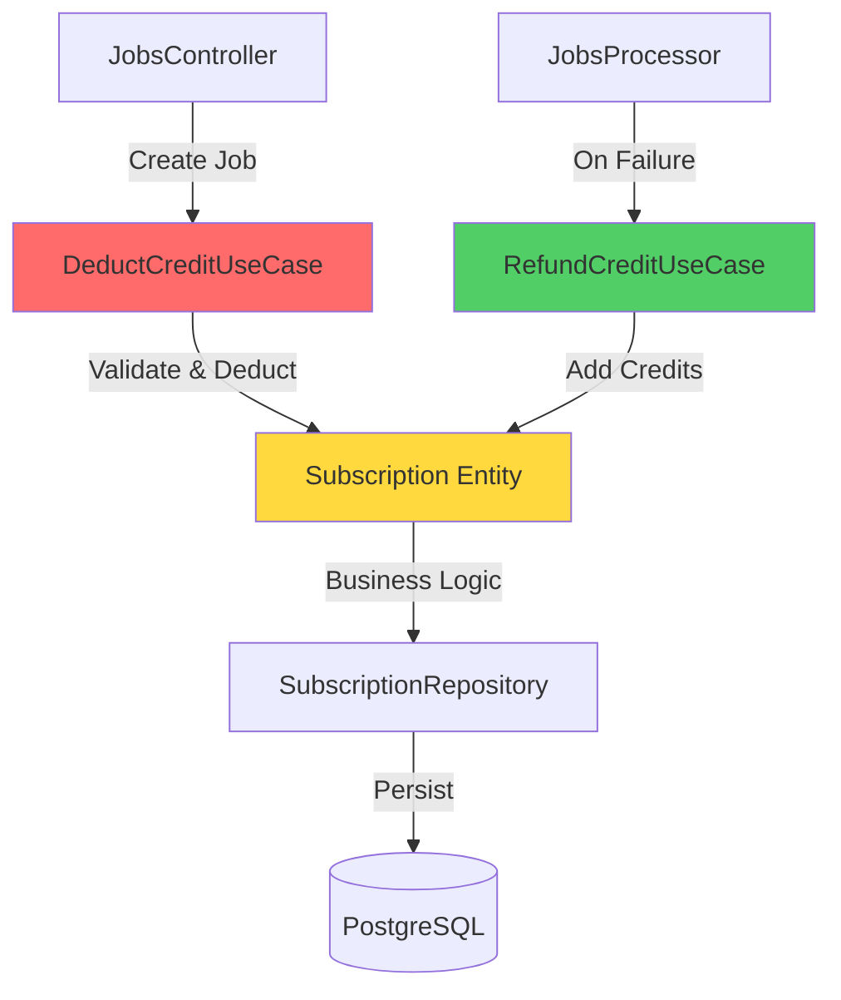

# Billing Module

**Purpose**: Credit-based payment system for resource consumption control.

## 🎯 Responsibility

Manages user subscriptions, credit balances, and billing operations to ensure only authorized users with sufficient credits can consume expensive resources (AI image generation).

## 🏗️ Architecture



**Pattern**: Domain-Driven Design with rich entities

- **Domain Layer**: `Subscription` entity with credit validation logic
- **Application Layer**: Use cases for deduct/refund operations
- **Infrastructure Layer**: Prisma repository + NestJS guards

## 📦 Components

### Domain Entities

#### `Subscription`

Rich domain entity managing credit lifecycle.

**Key Methods:**

```typescript
hasCredits(amount: number): boolean       // Check balance
deductCredits(amount: number): void       // Atomic deduction (throws if insufficient)
addCredits(amount: number): void          // Refund/purchase
```

**Factory Methods:**

```typescript
Subscription.createFree(userId, id); // New user with 10 credits
Subscription.restore(props); // Rehydrate from DB
```

### Use Cases

| Use Case                         | Responsibility             | Throws                      |
| :------------------------------- | :------------------------- | :-------------------------- |
| **`DeductCreditUseCase`**        | Deduct credits atomically  | `InsufficientCreditsError`  |
| **`RefundCreditUseCase`**        | Return credits on failure  | `SubscriptionNotFoundError` |
| **`GetUserSubscriptionUseCase`** | Retrieve subscription info | `SubscriptionNotFoundError` |

### Guards

#### `CreditGuard`

NestJS Guard to protect resource-intensive endpoints.

**Usage:**

```typescript
@UseGuards(JwtAuthGuard, CreditGuard)
@Post('jobs')
async createJob(@Body() dto: CreateJobDto) {
  // Only executed if user has credits > 0
}
```

## 💳 Credit Flow

```
1. User registers → Subscription created with 10 credits
2. User creates job → DeductCreditUseCase(-1 credit)
3. Job processing → AI generates image
4a. Success → Credit consumed
4b. Failure → RefundCreditUseCase(+1 credit)
```

## 🔒 Security

- **Atomic Operations**: Credit changes are transactional
- **Domain Validation**: Entity enforces business rules
- **Guard Protection**: Prevents unauthorized access

## ⚠️ Error Handling

### `InsufficientCreditsError`

Thrown when user attempts operation without sufficient balance.

**HTTP Response**: `403 Forbidden`  
**Message**: `"Insufficient credits. You have X credits remaining."`

### `SubscriptionNotFoundError`

Thrown when subscription doesn't exist for user.

**HTTP Response**: `404 Not Found`  
**Resolution**: Ensure subscription is created during user registration.

## 🚀 Integration

### Import in Other Modules

```typescript
@Module({
  imports: [BillingModule],
  // ...
})
export class JobsModule {}
```

### Inject Use Cases

```typescript
constructor(
  private readonly deductCredit: DeductCreditUseCase,
) {}
```

## 📊 Database Schema

```prisma
model Subscription {
  id                   String    @id @default(cuid())
  userId               String    @unique
  plan                 String    @default("FREE")
  status               String    @default("ACTIVE")
  creditsRemaining     Int       @default(10)
  currentPeriodStart   DateTime  @default(now())
  currentPeriodEnd     DateTime?
  stripeCustomerId     String?
  stripeSubscriptionId String?   @unique
}
```

## 🔮 Future Enhancements

- [ ] Stripe webhook integration for auto-refill
- [ ] Credit purchase flows
- [ ] Subscription plan upgrades (PRO, BUSINESS)
- [ ] Usage analytics dashboard
