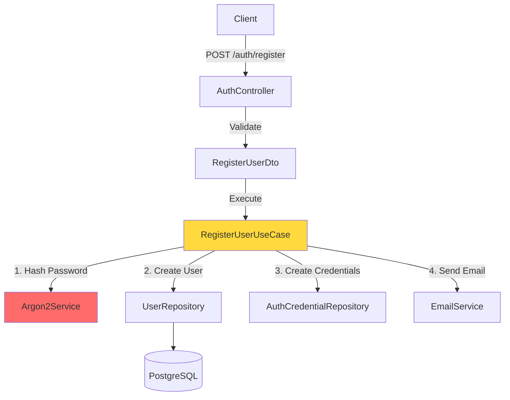

# IAM Module

**Identity & Access Management**

**Purpose**: Secure authentication, authorization, and user lifecycle management.

## 🎯 Responsibility

Controls user identity, authentication flows (register, login, password recovery), and access management with enterprise-grade security patterns.

## 🏗️ Architecture



**Pattern**: Hexagonal Architecture + Port-Adapter

- **Domain**: Pure business logic (no framework dependencies)
- **Application**: Use cases orchestrating workflows
- **Infrastructure**: Adapters for external systems (DB, email, JWT)

## 📦 Components

### Domain Entities

#### `User`

Core identity entity.

**Properties:**

```typescript
{
  id: string
  email: string
  fullName: string?
  role: UserRole           // USER | ADMIN
  status: UserStatus       // ACTIVE | PENDING | SUSPENDED
  emailVerifiedAt: Date?
}
```

**Methods:**

```typescript
user.isEmailVerified(): boolean
user.isActive(): boolean
user.isAdmin(): boolean
```

### Use Cases

| Use Case                    | Security               | Flow                              |
| :-------------------------- | :--------------------- | :-------------------------------- |
| **`RegisterUserUseCase`**   | Email unique check     | Create → Send verification        |
| **`LoginUserUseCase`**      | Argon2 password verify | Validate → Issue JWT              |
| **`RefreshTokenUseCase`**   | Token rotation         | Verify refresh → New access token |
| **`VerifyEmailUseCase`**    | Time-limited token     | Verify → Activate account         |
| **`ForgotPasswordUseCase`** | Rate limited           | Generate token → Send email       |
| **`ResetPasswordUseCase`**  | Token expiry check     | Validate → Update password        |

### Infrastructure

#### Adapters

- **`Argon2HashingService`**: Password hashing (OWASP recommended)
- **`JwtTokenService`**: JWT generation & verification
- **`PrismaUserRepository`**: User persistence
- **`NodemailerEmailService`**: Email delivery

#### Guards

- **`JwtAuthGuard`**: Validates JWT on protected routes
- **`RolesGuard`**: RBAC enforcement

**Usage:**

```typescript
@UseGuards(JwtAuthGuard, RolesGuard)
@Roles(UserRole.ADMIN)
@Get('admin/users')
async listUsers() { }
```

## 🔐 Security Features

### Password Security

- **Hashing**: Argon2id (memory-hard algorithm)
- **Validation**: 8+ chars, uppercase, lowercase, number, symbol
- **Storage**: Never stored in plaintext

### Token Strategy

```
Access Token:  15 minutes  (short-lived, stateless)
Refresh Token: 7 days      (long-lived, stored in DB)
```

**Token Rotation:**

- Old refresh token invalidated when used
- Detects token theft via `replacedById` tracking

### Rate Limiting

```typescript
@Throttle({ default: { limit: 5, ttl: 60000 } })
@Post('login')
async login() { }
```

**Config:**

- Login: 5 attempts/minute
- Password reset: 3 requests/hour
- Registration: 10/hour per IP

## 🚀 Integration

### Protecting Routes

```typescript
@UseGuards(JwtAuthGuard)
@Get('profile')
async getProfile(@User() user: UserEntity) {
  return user;
}
```

### Custom Decorator

```typescript
// Extract user from request
@User() user: UserEntity
```

## ⚠️ Error Handling

| Error                     | HTTP Code        | Scenario            |
| :------------------------ | :--------------- | :------------------ |
| `UserAlreadyExistsError`  | 409 Conflict     | Email in use        |
| `InvalidCredentialsError` | 401 Unauthorized | Wrong password      |
| `EmailNotVerifiedError`   | 403 Forbidden    | Login before verify |
| `TokenExpiredError`       | 401 Unauthorized | JWT expired         |

## 📊 Database Schema

```prisma
model User {
  id               String    @id @default(cuid())
  email            String    @unique
  fullName         String?
  role             String    @default("USER")
  status           String    @default("PENDING")
  emailVerifiedAt  DateTime?
  credentials      AuthCredential[]
  sessions         Session[]
}

model AuthCredential {
  userId       String
  provider     String
  passwordHash String?
}

model Session {
  id           String    @id
  userId       String
  tokenHash    String
  revokedAt    DateTime?
}
```

## 🔮 Future Enhancements

- [ ] OAuth2/OIDC (Google, GitHub)
- [ ] Two-Factor Authentication (TOTP)
- [ ] WebAuthn (passwordless)
- [ ] Session device management
