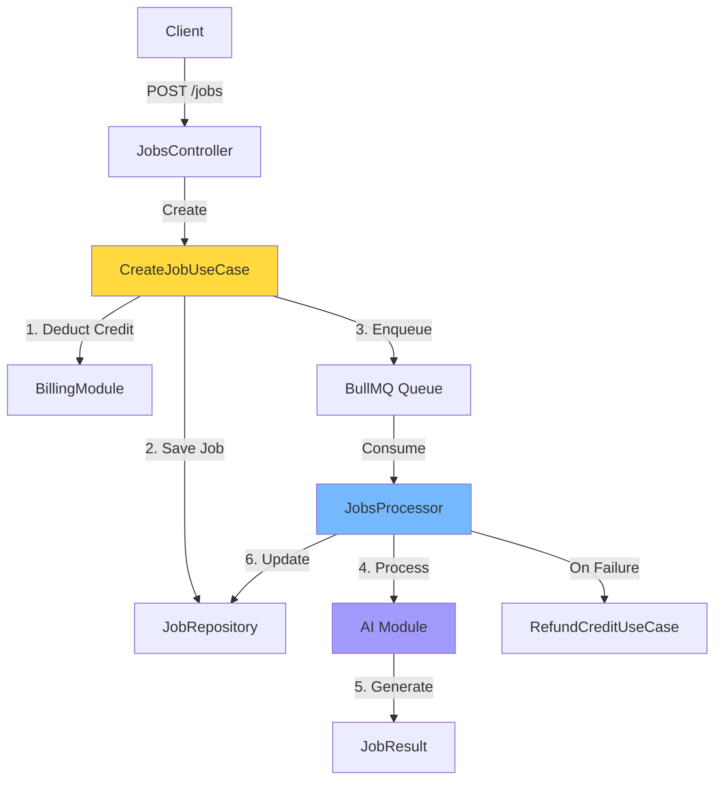

# Jobs Module

**Purpose**: Asynchronous job orchestration and processing for AI image generation.

## 🎯 Responsibility

Manages the full lifecycle of image processing jobs, from creation to completion, with queue-based asynchronous processing and resilient error handling.

## 🏗️ Architecture



**Pattern**: CQRS-lite (separate read/write paths) + Event-driven asynchronous processing

## 📦 Components

### Domain Entities

#### `Job`

Rich domain entity representing an image processing request.

**States:**

```typescript
enum JobStatus {
  QUEUED      // Created, waiting for worker
  PROCESSING  // Worker picked up
  COMPLETED   // Successfully finished
  FAILED      // Permanently failed
}
```

**Key Methods:**

```typescript
job.startProcessing(); // QUEUED → PROCESSING
job.complete(resultUrl); // PROCESSING → COMPLETED
job.fail(errorMessage); // → FAILED
job.incrementAttempts(); // Track retries
job.isMaxAttemptsExceeded(); // Check retry limit
```

### Use Cases

| Use Case                         | Responsibility          | Returns            |
| :------------------------------- | :---------------------- | :----------------- |
| **`CreateJobUseCase`**           | Create and enqueue job  | `JobResponseDto`   |
| **`GetJobUseCase`**              | Retrieve job details    | `JobResponseDto`   |
| **`ListUserJobsUseCase`**        | Get user's job history  | `JobResponseDto[]` |
| **`CancelJobUseCase`**           | Cancel pending job      | `void`             |
| **`CompleteJobManuallyUseCase`** | Admin manual completion | `void`             |

### Infrastructure

#### `JobsProcessor`

BullMQ worker consuming jobs from Redis queue.

**Flow:**

```typescript
1. Pick job from queue
2. Update status → PROCESSING
3. Call AI adapter
4. On success → Save result + COMPLETED
5. On failure → Increment attempts
   → If max exceeded → FAILED + refund credit
   → Else → retry
```

#### `BullMqQueueAdapter`

Adapter implementing `QueueServicePort

` for BullMQ.

**Operations:**

```typescript
enqueue(jobId, data); // Add to queue
remove(jobId); // Cancel job
getMetrics(); // Queue statistics
```

## 🔄 Job Lifecycle

```
┌─────────┐
│ QUEUED  │ ← Job created, credit deducted
└────┬────┘
     │
     ▼
┌─────────────┐
│ PROCESSING  │ ← Worker picked up
└──┬─────┬────┘
   │     │
   │     │ (Retry if transient error)
   │     └───────┐
   │             │
   ▼             ▼
┌──────────┐  ┌────────┐
│COMPLETED │  │ FAILED │ ← Max attempts exceeded → Credit refunded
└──────────┘  └────────┘
```

## 🚀 Integration

### Creating a Job

```typescript
@Post('jobs')
@UseGuards(JwtAuthGuard, CreditGuard)
async createJob(@User() user, @Body() dto: CreateJobDto) {
  return this.createJobUseCase.execute(user.id, dto);
}
```

### Starting Background Worker

```bash
# Terminal 1: API server
pnpm run start:dev

# Terminal 2: Worker
pnpm run start:worker
```

**Environment:**

```env
ENABLE_WORKER=true   # Must be set for worker process
REDIS_HOST=localhost
REDIS_PORT=6379
```

## ⚙️ Configuration

### Queue Settings

```typescript
// retry strategy
attempts: 3               // Max retries
backoff: {
  type: 'exponential',
  delay: 5000            // 5s → 25s → 125s
}
```

## ⚠️ Error Handling

### Transient Errors (Retry)

- Network timeouts
- AI service temporarily unavailable
- Rate limit exceeded

### Permanent Errors (No Retry)

- Invalid image format
- Image too large
- Corrupted upload

## 📊 Database Schema

```prisma
model Job {
  id         String     @id @default(cuid())
  userId     String
  imageId    String?
  mode       String
  status     String     @default("queued")
  prompt     String?
  meta       Json?
  attempts   Int        @default(0)
  result     JobResult?
}

model JobResult {
  id         String   @id @default(cuid())
  jobId      String   @unique
  url        String
  metadata   Json?
}
```

## 🔮 Future Enhancements

- [ ] Priority queue for premium users
- [ ] Batch processing
- [ ] Webhook notifications
- [ ] Job cancellation with partial refunds
