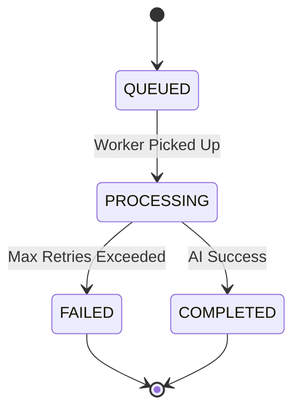

# Jobs Module

**Purpose**: Asynchronous job orchestration engine for AI image generation.

## 🧠 Context & Decisions

### Why Asynchronous Processing?

AI image generation is computationally expensive and slow (10-30 seconds). A synchronous REST request would timeout or block the main thread.

- **Decision**: We use **Queue-Based Load Leveling** pattern with BullMQ.
- **Result**: The API accepts the request instantly (201 Created) and offloads work to a background worker, ensuring high throughput and resilience.

### Why WebSockets for Notifications?

Poling a `/jobs/:id` endpoint every second wastes server resources and bandwidth.

- **Decision**: We implemented a **WebSocket Gateway** (Socket.io).
- **Flow**: Worker finishes job → Emits event → Gateway pushes update to client.
- **Result**: Instant feedback for the user (<50ms latency after completion).

### Hybrid Architecture for Scaling

We separated the **HTTP API** from the **Worker** process.

- **API**: I/O bound, handles requests/responses. Scales easily.
- **Worker**: CPU/Network bound, handles AI processing. Scales based on queue depth.
  This allows us to scale them independently (e.g., 2 API instances, 10 Worker instances).

## 🏗️ Architecture

```mermaid
graph TB
    Client[Client App] -->|1. POST /jobs| Controller[JobsController]
    Client -->|2. Connect WS| WS[WebSocket Gateway]

    Controller -->|3. Enqueue| Queue[BullMQ (Redis)]

    subgraph "Background Worker"
        Worker[JobsProcessor] -->|4. Consume| Queue
        Worker -->|5. Call AI| Gemini[Gemini API]
        Worker -->|6. Save| DB[(PostgreSQL)]
        Worker -->|7. Publish| EventPort[EventEmitterPort]
    end

    EventPort -->|8. Notify| WS
    WS -->|9. Push Event| Client

    style Worker fill:#74b9ff
    style Queue fill:#fab1a0
    style WS fill:#55efc4
```

## 📦 Core Components

### 1. Job Orchestrator

Manages the state machine of a job.

- `QUEUED` → `PROCESSING` → `COMPLETED` | `FAILED`

### 2. WebSocket Gateway (`JobsGateway`)

- **Room Strategy**: Clients join `user:{userId}` rooms. This ensures security (users only receive their own events).
- **Redis Adapter**: We use the Redis Adapter for Socket.io to support horizontal scaling. If the API Gateway scales to 5 instances, a user connected to Instance A can still receive an event generated by a job on Instance B.

### 3. Resilience Patterns

- **Retries**: Exponential backoff (5s, 25s, 125s) for transient AI errors.
- **Dead Letter Queue**: Failed jobs are persisted for manual inspection.

## 🔄 Job Lifecycle



## 🔌 API Contracts

### Create Job

`POST /jobs`

```json
// Response
{
  "id": "job-123",
  "status": "QUEUED"
}
```

### Real-Time Event

**Event:** `job:status`

```json
{
  "jobId": "job-123",
  "status": "COMPLETED",
  "resultUrl": "https://s3.aws...",
  "completedAt": "2026-01-15T10:00:00Z"
}
```

## 🛠️ Configuration

Key environment variables that drive this module:

```bash
REDIS_HOST=localhost        # For Queue & WebSocket Pub/Sub
ENABLE_WORKER=true          # If true, this process runs job consumer
ENABLE_REDIS_ADAPTER=true   # Enable socket.io-redis adapter
```
