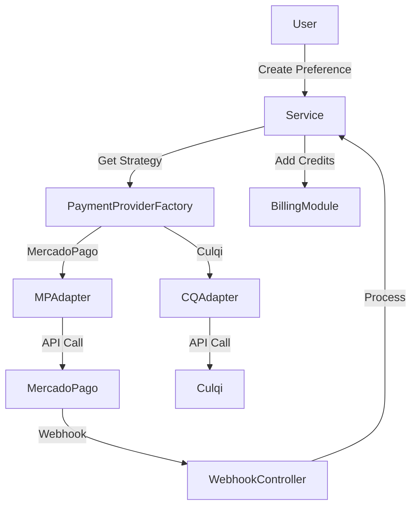

# 💳 Payments Module

Robust, multi-provider payment system built with Strategy Pattern and Circuit Breaker resilience.

## 🌟 Features

- **Multi-Provider Strategy:** Seamlessly switch between payment gateways (Mercado Pago, Culqi, Crypto).
- **Circuit Breaker:** Automatically detects provider outages and prevents cascading failures.
- **Webhooks:** Dedicated webhook handlers for each provider with idempotency.
- **Credit Packages:** Configurable packages managed via Database Seeding.
- **Security:** Signature verification and localized credential management.

## 🏗️ Architecture



## 🔌 Providers

### 1. Mercado Pago (Live)

- **Status:** ✅ Active
- **Type:** Redirect / Checkout Pro
- **Webhook Endpoint:** `/payments/webhook/mercadopago`
- **Configuration:**
  ```env
  MP_ACCESS_TOKEN=TEST-...
  MP_WEBHOOK_SECRET=...
  ```

### 2. Culqi (Ready)

- **Status:** 🚧 Template Ready (Inactive)
- **Type:** Token / Charge
- **Webhook Endpoint:** `/payments/webhook/culqi`
- **Activation:**
  1. Set `isActive = true` in DB.
  2. Implement `culqi-node` in adapter.
  3. Uncomment in `PaymentProviderFactory`.

## 📦 Data Utils

### Seeding Packages

Run the following command to populate the database with default credit packages:

```bash
pnpm prisma db seed
```

**Default Packages:**

- `pkg-basic`: 10 Credits
- `pkg-pro`: 60 Credits (Best Value)
- `pkg-enterprise`: 500 Credits

## 📡 API Endpoints

| Method | Endpoint                        | Description                    |
| :----- | :------------------------------ | :----------------------------- |
| `GET`  | `/payments/providers`           | List active payment providers  |
| `GET`  | `/payments/packages`            | List available credit packages |
| `POST` | `/payments/create-preference`   | Initialize a payment flow      |
| `POST` | `/payments/webhook/mercadopago` | Handle MP notifications        |

## 🧪 Testing Webhooks

You can verify webhook processing using the generic endpoint:

```bash
curl -X POST http://localhost:3000/api/v1/payments/webhook/mercadopago \
  -H "Content-Type: application/json" \
  -d '{
    "action": "payment.updated",
    "data": { "id": "123456" }
  }'
```
