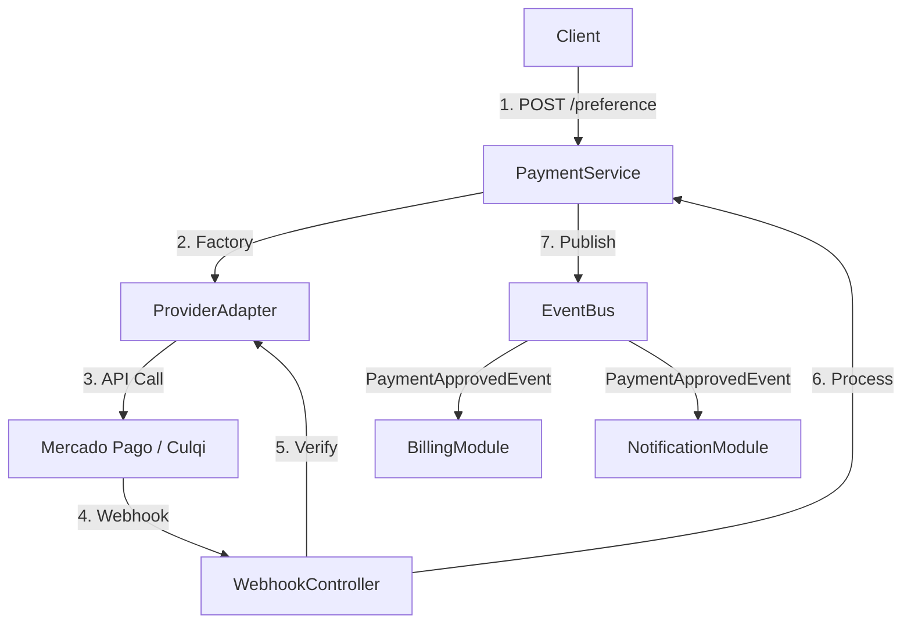

# Payments Module

**Purpose**: Handles money-in operations through multiple external gateway integrations.

## 🧠 Context & Decisions

### Why the Strategy Pattern?

We need to support multiple payment providers (Mercado Pago, Culqi, Crypto, Stripe) without modifying the core payment processing logic.

- **Decoupling**: Adding a new provider is as simple as creating a new class implementation.
- **Runtime Switching**: The `PaymentProviderFactory` selects the correct strategy based on the `provider` string in the request (or valid configuration).
- **Open/Closed Principle**: We can add new providers (Open for extension) without changing the service code (Closed for modification).

### Event-Driven Integration

This module is strictly for **processing payments**. It does Not know about "Credits" or "Subscriptions".

- **Flow**: Webhook received → Signature Verified → Payment Validated → **Event Published**.
- **Decoupling**: The Payments module publishes `PaymentApprovedEvent`. It doesn't care who listens (Billing, Notification, Analytics). This prevents circular dependencies.

## 🏗️ Architecture



## 📦 Core Components

### 1. Provider Adapter Interface

All providers must implement `PaymentProviderPort`:

```typescript
interface PaymentProviderPort {
  createPreference(data: PaymentData): Promise<PreferenceResult>;
  validateWebhook(payload: any, signature: string): Promise<boolean>;
  processWebhook(payload: any): Promise<PaymentResult>;
}
```

### 2. Circuit Breaker

We wrap external API calls in a Circuit Breaker.

- **Why?**: If Mercado Pago is down, we fail fast instead of hanging the thread.
- **Behavior**: After 5 failures, the circuit opens for 30 seconds.

## 🔌 Supported Providers

| Provider         | Status   | Key Features                                      |
| :--------------- | :------- | :------------------------------------------------ |
| **Mercado Pago** | ✅ Live  | Redirect Checkout, Webhook Signature Verification |
| **Culqi**        | 🚧 Ready | Tokenized Cards, Anti-fraud                       |

## 🚀 Integration Spec

### 1. Creating a Preference

**POST** `/payments/create-preference`

```json
{
  "provider": "mercadopago",
  "items": [{ "id": "pkg-basic", "title": "10 Credits", "price": 10.0 }],
  "payerEmail": "user@example.com"
}
```

### 2. Webhook Handling

**POST** `/payments/webhook/:provider`

- Idempotency: Handled by `paymentId` unique constraint.
- Security: `x-signature` header validation.

## ⚠️ Configuration

Ensure you have the strategies configured in `.env`:

```bash
# Mercado Pago
MP_ACCESS_TOKEN=TEST-123...
MP_WEBHOOK_SECRET=...

# Payment Logic
CURRENCY=USD
```
