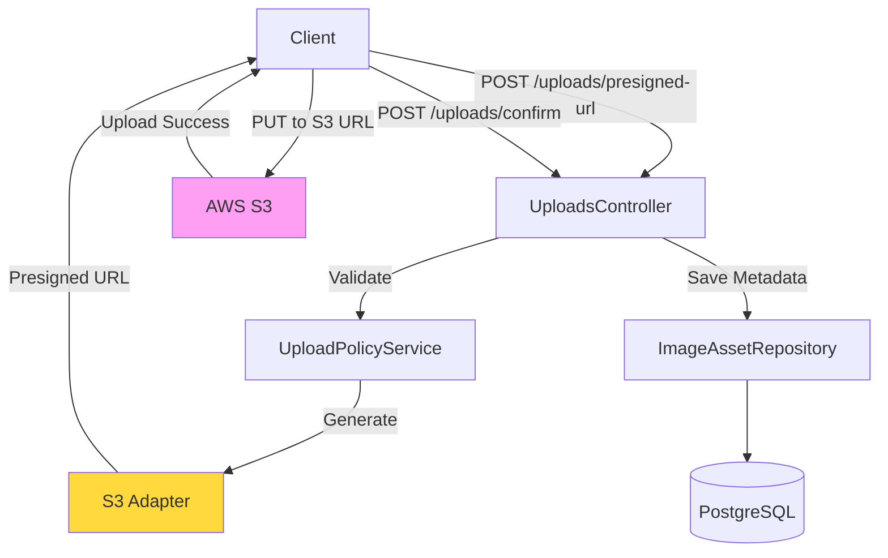

# Uploads Module

**Purpose**: Secure file upload management with presigned URLs and S3 integration.

## 🎯 Responsibility

Handles image asset lifecycle: presigned URL generation for client-side uploads, metadata storage, and integration with AWS S3 for scalable object storage.

## 🏗️ Architecture



**Pattern**: Presigned URL strategy (client-side direct upload)

- **Avoids**: File streaming through API server
- **Benefits**: Reduced bandwidth costs, faster uploads, better UX
- **Security**: Time-limited URLs with size/type restrictions

## 📦 Components

### Domain

#### `ImageAsset`

Entity representing uploaded image metadata.

**Properties:**

```typescript
{
  id: string
  userId: string
  filename: string
  s3Key: string
  s3Bucket: string
  mimeType: string
  sizeBytes: number
  width?: number
  height?: number
}
```

### Use Cases

| Use Case                          | Responsibility                    | Returns        |
| :-------------------------------- | :-------------------------------- | :------------- |
| **`GeneratePresignedUrlUseCase`** | Create time-limited S3 upload URL | `{ url, key }` |
| **`ConfirmUploadUseCase`**        | Save asset metadata after upload  | `ImageAsset`   |
| **`DeleteImageAssetUseCase`**     | Remove asset from S3 and DB       | `void`         |

### Infrastructure

#### `S3StorageAdapter`

Implements `StorageServicePort` for AWS S3.

**Methods:**

```typescript
generatePresignedUrl(key, contentType, expiresIn): string
deleteObject(key): Promise<void>
getObjectMetadata(key): Promise<Metadata>
```

#### `UploadPolicyService`

Validates upload constraints.

**Rules:**

```typescript
MAX_FILE_SIZE: 10MB
ALLOWED_MIME_TYPES: ['image/jpeg', 'image/png', 'image/webp']
PRESIGNED_URL_EXPIRY: 5 minutes
```

## 🔄 Upload Flow

```
1. Client requests presigned URL
   ↓
2. API validates (size, type, auth)
   ↓
3. Generate S3 presigned URL
   ↓
4. Return URL to client
   ↓
5. Client uploads directly to S3
   ↓
6. Client confirms upload to API
   ↓
7. API saves asset metadata
```

**Code Example:**

```typescript
// Step 1-4: Get presigned URL
const { url, key } = await this.generatePresignedUrlUseCase.execute({
  filename: 'product.jpg',
  contentType: 'image/jpeg',
  sizeBytes: 2048000,
});

// Step 5: Client uploads to S3
await fetch(url, {
  method: 'PUT',
  body: file,
  headers: { 'Content-Type': 'image/jpeg' },
});

// Step 6-7: Confirm upload
await this.confirmUploadUseCase.execute({
  s3Key: key,
  filename: 'product.jpg',
  mimeType: 'image/jpeg',
});
```

## 🔒 Security

### Validation Layers

1. **File Type**: Only images allowed (JPEG, PNG, WebP)
2. **File Size**: Max 10MB
3. **Authentication**: Must be logged in
4. **Rate Limiting**: 100 uploads/hour per user
5. **URL Expiry**: Presigned URLs valid for 5 minutes

### S3 Bucket Policy

```json
{
  "Version": "2012-10-17",
  "Statement": [
    {
      "Effect": "Allow",
      "Principal": "*",
      "Action": "s3:PutObject",
      "Resource": "arn:aws:s3:::bucket/uploads/*",
      "Condition": {
        "StringEquals": {
          "s3:x-amz-server-side-encryption": "AES256"
        }
      }
    }
  ]
}
```

## ⚙️ Configuration

### Environment Variables

```env
AWS_REGION=us-east-1
AWS_S3_BUCKET=photo-expert-uploads
AWS_ACCESS_KEY_ID=<key>
AWS_SECRET_ACCESS_KEY=<secret>
```

### S3 Folder Structure

```
bucket/
├── uploads/           # User uploads
│   ├── user-123/
│   └── user-456/
└── results/           # AI-generated images
    ├── job-abc/
    └── job-def/
```

## ⚠️ Error Handling

| Error                      | Code | Scenario        |
| :------------------------- | :--- | :-------------- |
| `FileTooLargeError`        | 413  | Size > 10MB     |
| `UnsupportedFileTypeError` | 415  | Wrong MIME type |
| `UploadNotFoundError`      | 404  | Invalid S3 key  |
| `S3ServiceError`           | 503  | AWS unavailable |

## 🔮 Future Enhancements

- [ ] Image optimization (resize, compress)
- [ ] CDN integration (CloudFront)
- [ ] Virus scanning (ClamAV)
- [ ] Multi-part uploads for large files
- [ ] Progress tracking webhooks
